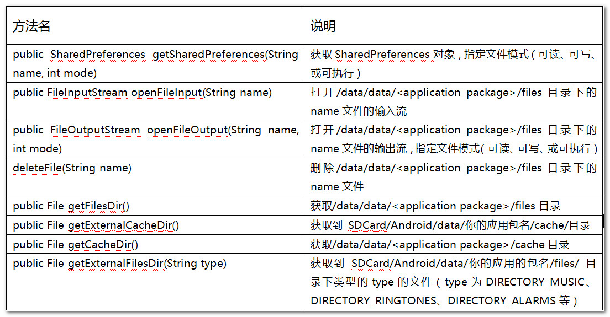

##Android数据存储的五种方式：
1. SharedPerferences 共享偏好
2. Intelnal Storage 内部存储
3. External Storage 外部存储
4. SQLite Database 数据库
5. Internet 网络

###SharedPerferences 共享偏好
* 一般用于存储一些配置文件，方便灵活
* 相当于一个HashMap，但是hashmap可以存储任何数据，而sharedPerferences的值只能存储基本数据类型

###Internal Storage 内部存储
* 手机内置的存储空间
* 对于用户和应用程序而言，data/data/应用程序名 所在的文件夹就是内部存储，sharederferences、Files、SQLite都是存储在这个文件夹下的
* 使用内部存储的方法有两种，一种是文件操作，一种是文件夹操作，两种方法都有Context提供方法支持

###External Storage 外部存储
* 一般是指手机中的SD卡，所以使用SD卡存储数据的时候要先判断SD卡的状态，在使用

		final String state = Environment.getExternalStorageState();      
		if (state.equals(Environment.MEDIA_MOUNTED) || state.equals(Environment.MEDIA_READ_ONLY)) {
		    .....业务逻辑....
		 } 
* 外部存储离不开Environment类和StaFs类 
* 注意事项
	* （1）使用之前要先判断SD卡的状态
	* （2）SD卡存储的数据其他应用程序也是可以查看的，包括其他用户，所以其安全性不是太好
	* （3）SD卡存储数据的时候，要做好异常处理，例如SD不存在的时候，怎么处理，SD卸载的时候...
	* （4）当手机连接电脑的时候，SD上升为PC端的U盘，这时候手机上设置的Sd中文件的权限在PC端就没什么用了

###SQLite Database 数据库
* 这是Android中自身集成的数据库，Android十分依赖SQLite数据库，它的系统数据和其他结构化数据都是存储在数据库中的，具有非常多的优点：
	* 效率出众
	* 十分适合存储结构化数据
	* 方便在不同的activity，甚至不同的应用程序之间进行数据传输
	* 由专门的Contentprovider来帮忙管理 
	* 方便设置权限，私有还是全部可见
	* 操作方便，使用标准的CRUDE语句，ContentResolver.query(), update(), delete() insert()，详见ContentResolver 
	* 良好的可移植性和通用性，用标准的SQL语句能实现CRUDE

###Internet 网络存储
* 数据存储在网络
* 弊端：网络数据依赖于网络

##数据库存储
 
* 继承SQLiteOpenHelper的类重写onCreate(SQLiteDatabase db) 创建表等初始化操作会在该方法中执行
* onUPgrade() 当打开数据库的时候传入的版本号与当前版本号不同的时候会调用该方法
* onOpen()  每次数据库被打开的时候调用