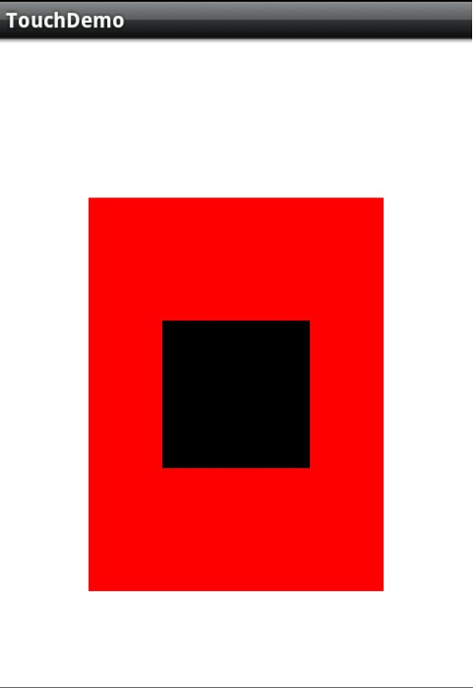
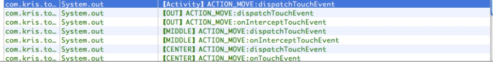
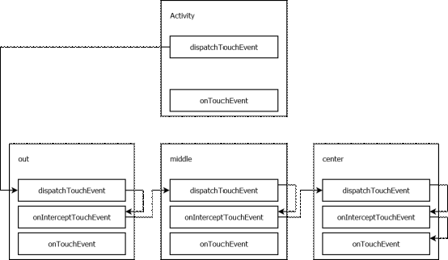
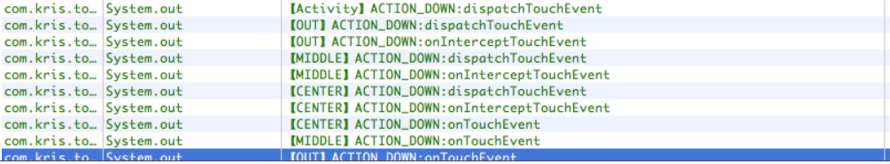
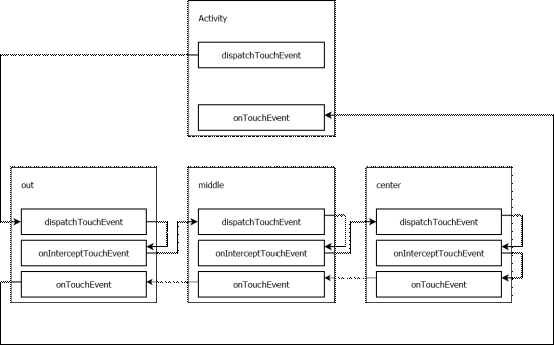

##Touch事件的传递
###Android中的每个ViewGroup的子类都有三个与TouchEvent处理相关的方法
###（其实也并不是所有的View的子类，好多教程上说是所有的View的子类，只有可以向里面添加View的控件才需要分发，比如TextView，本身就是一个最小的View，就不可能向它的子视图分发了，它也没有子试图，所以它没有dispatch，intercept，只有touchEvent）
1. public boolean dispatchTouchEvent(MOtionEvent ev) 用来派发TouchEvent
	* 如果 return true，事件会分发给当前 View 并由 dispatchTouchEvent 方法进行消费，同时事件会停止向下传递；
	* 如果 return false，事件分发分为两种情况：(总之就是返回其上级处理)
		* 如果当前 View 获取的事件直接来自 Activity，则会将事件返回给 Activity 的 onTouchEvent 进行消费；
		* 如果当前 View 获取的事件来自外层父控件，则会将事件返回给父 View 的  onTouchEvent 进行消费。
	* 如果返回系统默认的 super.dispatchTouchEvent(ev)，事件会自动的分发给当前 View 的 onInterceptTouchEvent 方法。
2. public boolean onInterceptTouchEvent(MotionEvent ev) 用来拦截Touchevent
	* 如果 onInterceptTouchEvent 返回 true，则表示将事件进行拦截，并将拦截到的事件交由当前 View 的 onTouchEvent 进行处理；
	* 如果 onInterceptTouchEvent 返回 false，则表示将事件放行，当前 View 上的事件会被传递到子 View 上，再由子 View 的 dispatchTouchEvent 来开始这个事件的分发；
	* 如果 onInterceptTouchEvent 返回 super.onInterceptTouchEvent(ev)，事件默认会被拦截，并将拦截到的事件交由当前 View 的 onTouchEvent 进行处理。
3. public boolean onTouchEvent(MotionEvent ev) 用来处理TouchEvent
	* 如果事件传递到当前 View 的 onTouchEvent 方法，而该方法返回了 false，那么这个事件会从当前 View 向上传递，并且都是由上层 View 的 onTouchEvent 来接收，如果传递到上面的 onTouchEvent 也返回 false，这个事件就会“消失”，而且接收不到下一次事件。
	* 如果返回了 true 则会接收并消费该事件。
	* 如果返回 super.onTouchEvent(ev) 默认处理事件的逻辑和返回 false 时相同。

##案例演示一

* UI有三层自定义的View叠加的，本质是LinearLayout，自定义的View中处理了一些日志打印；

* 首先，最内层的View的Clickable属性设置为true;点击中心view控件后查看日志可以看到

* 这个操作ACTION_DOWN事件的处理流程如下图

* 解释：触摸事件发生后，系统调用Activity的派发touch事件的方法，传递touchevent，将此事件传递给外部控件的派发touch事件的方法处理，外部控件调用拦截touch事件的方法判断是由自己处理还是继续分发给子View，这里外部控件不处理Touch事件，根据坐标传递给外部View的子View也就是中间的View,
中间层View和中心层View处理过程和上面一样，传递到中心层的interceptOutochEvent时，其属性Clickable为True表示其要处理Touch事件，所以中心View拦截事件将方法传递给自己的onTouchEvent方法，touch事件就不会被传递了

##案例二
* UI和上面一样，只是不指定谁去处理Touch事件，代码少了中心层View的clickable="true",显示日志如下:

* 这个操作ACTION_DOWN事件的处理流程如下图

* 解释：流程处理是和上个案例一样的，只不过在传递过程中没有一个View去处理这个touch事件，所以层层逆向传递回到Activity；
* Down事件如此，一个Down事件确定了Activity的处理touch事件的方法，对于后面的move和up方法都会直接由activity处理

##总结：
1. Touch事件返回true,自己消费这个Touch事件；返回false表示自己不处理事件，继续传递
2. 事件传递的两种方式：
	* 隧道方式：由根元素往下传递直到最内层元素或者在中间某一元素中由于某一条件停止传递
	* 冒泡方式： 从最内层的子元素依次往外传递直到根元素或者中间某一元素由于某一条件停止传递。

##通俗讲解

    话说一家软件公司，来一个任务，分派给了开发经理去完成：

    开发经理拿到，看了一下，感觉好简单，于是

    开发经理：分派给了开发组长

    开发组长：分派给了自己组员（程序员）

    程序员：分派给了自己带的实习生。

    实习生：好苦逼，无法分派，怎么办啊？只能自己干了

    但是实习生能不能做好，有两种情况了。

    情况一：

    实习生：经过一段时间的研究，琢磨，熬夜，奋斗，死敲，皇天不负有心人啊，完成了。

    后来又来一个类似的任务，也按着这样传递下去了（开发经理->开发组长->程序员->实习生），又有实习生完成了。

    情况二：

    实习生：经过一段时间的研究，琢磨，就是毫无头绪，无法完成，只能求教师傅（程序员）了。

    程序员：啊，我怎么没留意就给实习生搞了，这任务好难啊，自己研究下，也没有头绪，没办法只能请求组长了。

    开发组长：这任务不难啊，怎么我底下的人都不会了，没办法，只能自己搞了，经过，一段时间，完成了，感想，以后要是又有跟这个很类似的任务，我就自己弄了，不给他们弄了。

    后来又来一个类似的任务，传递是这样的

    开发经理：分派给开发组长

    开发组长：啊，又是跟着上一个很类似的任务，我自己弄吧，没过多久也完成了！

	

##疑问
* ontouch若返回true,上层不再处理，。如果返回fasle,传递到上层控件中，下层的View就不能再处理后续事件了，如果需要下层和上层都处理Touch事件的时候，就有疑问了
* gallery (可以左右滑动图片，图片也可以缩放以及进行操作)--ViewFlipper