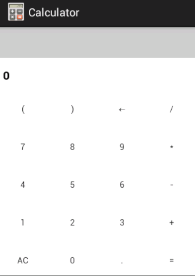

##计算器的实现

###导入项目文件时报错
* import项目文件的时候报 Invalid project description（detail：Invalid project description.
  D:\Android Code\09_review overlaps the location of another project: '09_review'）
* 主要原因：导入的项目放在了当前的工作空间，要导入的源码以及自己创建的项目文件，在eclipse中delete后不能直接import到eclipse
* 解决办法：将要导入的项目放到其他目录中，只要不是eclipse的工作空间

### 注意事项
* 相同的布局的抽取，可以将相同的布局抽取出来放在res/values/styles.xml文件中
* TextVIew必须要设置  onclickable = "true" ,才可以点击
* 计算器中的逻辑实现主要是通过js中eval(""),返回json格式的值
* webview显示设置  WebView名.getSettings().setJavaScriptEnabled(true)
* WebView显示 WebView名.loadUrl();
	* ---wv_output.loadUrl("file:///android_asset/index.html")
	* ---wv_output.loadUrl("javascript:caculate("+ ipstr+")");

###布局的抽取
	原始布局

        <LinearLayout
            android:orientation="horizontal"
            android:layout_width="match_parent"
            android:layout_height="0dp"
            android:layout_weight="1" >
        </LinearLayout>

	布局抽取-res/values/styles.xml

	

	引入样式

        <LinearLayout
            style="@style/CaculatorRowStyle">
        </LinearLayout>

###WebView的两种使用方法
* 第一种方法的步骤：
	1. 在activity中实例化WebView控件
	2. 设置WebView属性，能够执行js脚本 webview.getSettings().setJavaScriptEnabled(ture);
	3. 加载需要显示的网页 
		* 互联网用：webview.loadUrl("http://www....")
		* 本地文件 webview.loadUrl("file:///android_asset/xx.html")
	4. 调用Activity的setContentView()方法来显示网页视图
	5. 用Webview点链接看了很多页以后为了让Webview支持回退功能，一般重写activity类中onKeyDown()方法，如果不做任何处理，点击系统回退键，整个浏览器会调用finish()结束自身而不是回退到前一个页面
	6. 添加权限
* 第二种方法的步骤	
	1. 在布局文件中声明Webview
	2. 在activity中实例化Webview
	3. .....
