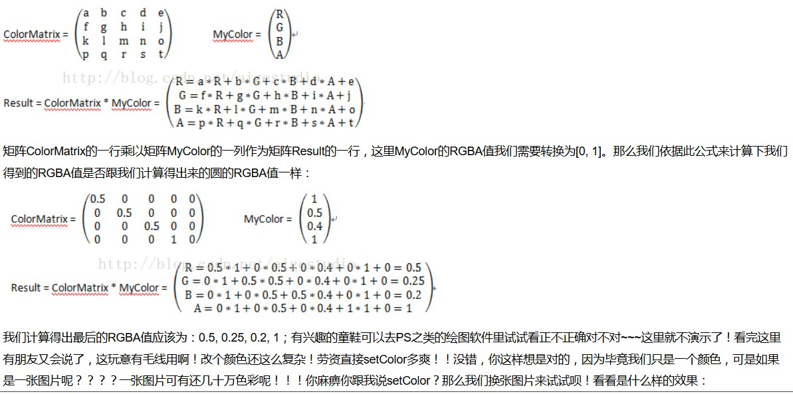

##色彩矩阵
* 可以给图像的色彩过滤ColorMatrixColorFilter
1. 色彩矩阵可以给图像添加滤镜----66666

	    public class CustomView extends View {  
        private Paint mPaint;// 画笔  
        private Context mContext;// 上下文环境引用  
        private Bitmap bitmap;// 位图  
          
        private int x,y;// 位图绘制时左上角的起点坐标  
      
        public CustomView(Context context) {  
            this(context, null);  
        }  
      
        public CustomView(Context context, AttributeSet attrs) {  
            super(context, attrs);  
            mContext = context;  
      
            // 初始化画笔  
            initPaint();  
              
            //初始化资源  
            initRes(context);  
        }  
      
        /** 
         * 初始化画笔 
         */  
        private void initPaint() {  
            // 实例化画笔  
            mPaint = new Paint(Paint.ANTI_ALIAS_FLAG);  
        }  
          
        /** 
         * 初始化资源 
         */  
        private void initRes(Context context) {  
            // 获取位图  
            bitmap = BitmapFactory.decodeResource(context.getResources(), R.drawable.a);  
              
            /* 
             * 计算位图绘制时左上角的坐标使其位于屏幕中心 
             * 屏幕坐标x轴向左偏移位图一半的宽度 
             * 屏幕坐标y轴向上偏移位图一半的高度 
             */  
            x = MeasureUtil.getScreenSize((Activity) mContext)[0] / 2 - bitmap.getWidth() / 2;  
            y = MeasureUtil.getScreenSize((Activity) mContext)[1] / 2 - bitmap.getHeight() / 2;  
        }  
      
        @Override  
        protected void onDraw(Canvas canvas) {  
            super.onDraw(canvas);  
      
            // 绘制位图  
            canvas.drawBitmap(bitmap, x, y, mPaint);  
        }  
		}  

* 在代码中为paint添加色彩过滤
	
	    ColorMatrix colorMatrix = new ColorMatrix(new float[]{  
            0.33F, 0.59F, 0.11F, 0, 0,  
            0.33F, 0.59F, 0.11F, 0, 0,  
            0.33F, 0.59F, 0.11F, 0, 0,  
            0, 0, 0, 1, 0,  
    	});  
		mPaint.setColorFilter(new ColorMatrixColorFilter(colorMatrix)); 
* 显示结果

* 再设一个色彩过滤
	
		ColorMatrix colorMatrix = new ColorMatrix(new float[]{  
	        0, 0, 1, 0, 0,  
	        0, 1, 0, 0, 0,  
	        1, 0, 0, 0, 0,  
	        0, 0, 0, 1, 0,  
		}); 
* 显示结果

 